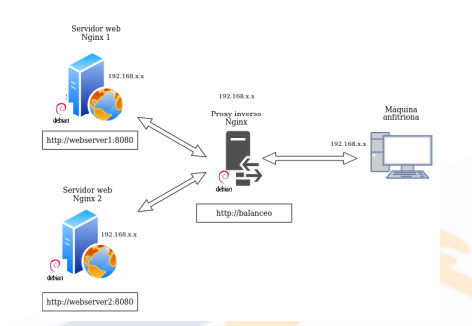

# Tema 2 
## Balanceador de carga con Proxy Inverso en Nginx
> La practica [2.3](https://iamabhijeet2003.github.io/DEAW/Temario/Tema2-2.3.html) debe estar funcionando para hacer esta practica

Necesitamos 3 maquinas para esta practica.

- Debian 1 con webserver1

- Debian 2 con webserver2

- Debian con Proxy Configurado



### Configuraciones 

#### Debian 1 con `webserver1`
configuramos el block server que escuche por el puerto 8080
dentro de `/etc/nginx/sites-available`
y en el `/var/www/webserver1/html`
añadimos:
```
<html>
    <head>
        <title>Load Balancer</title>
    </head>

    <body>
        <h1> Este es el server1 </h1>
    </body>
</html>
```
hacemos el enlace simbolico pertinente y reiniciamos nginx.

#### Debian 2 con `webserver2`
configuramos el block server que escuche por el puerto 8080
dentro de `/etc/nginx/sites-available`
y en el `/var/www/webserver2/html`
añadimos:
```
<html>
    <head>
        <title>Load Balancer</title>
    </head>

    <body>
        <h1> Este es el server2 </h1>
    </body>
</html>
```
hacemos el enlace simbolico pertinente y reiniciamos nginx.

#### Nginx Proxy Inverso

creamos el server block con nombre `balance`
con la siguiente configuración:
dentro de `/etc/nginx/sites-available`
```
upstream backend_hosts {
    random;
    server webserver1:8080;
    server webserver2:8080;
}

server{
    listen 80;
    server_name balance;
    location / {
        proxy_pass http://backend_hosts;
    }
}

```

Accedemos al `http://balance` y compruebamos que se balancea la carga correctamente