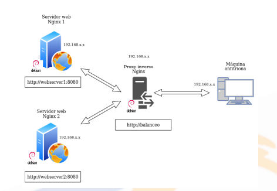
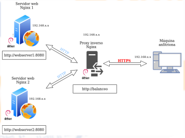

# Tema 2
## Proxy inverso y balance de carga con SSL en NGINX

> La practica [2.4](Tema2-2.4.md) debe estar funcionando correctamente para hacer esta practica.

Partimos de la configuracion de la practica anterior.


Simplemente para hacer esta practica tenemos que añadir la configuracion SSL para el cifrage en el proxy Inverso. La configuracion finalmente quedaría:



### Creación de Certificado 
Nosotros no utilizaremos certificados de ninguna CA de confianza, básicamente porque:
- Nuestros servicios no están publicados en Internet.
- Estos certificados son de pago.

Creamos el directorio para el certificado
```
sudo mkdir /etc/nginx/ssl
```
y ahora creamos el certificado y la llaves:
```
sudo openssl req -x509 -nodes -days 365 -newkey rsa:2048 -keyout /etc/nginx/ssl/server.key -out /etc/nginx/ssl/server.crt
```
Rellenamos los datos que nos pide y nos generera el certificado.

De la practica anterior tenemos el archivo `balance` dentro de `/etc/nginx/sites-available` y dentro de la cual en el server bloque añadimos:
```
listen 443 ssl;
ssl_certificate /etc/nginx/ssl/server.crt;
ssl_certicate_key /etc/nginx/ssl/server.key;
ssl_protocols TLSv1.3;
ssl_ciphers ECDH-AESGCM:DH+AESGCM:ECDH+AES256:DH+AES256:ECDH+AES128:DH+AES128:ECDH+3DES:DH+3DES:RSA+AESGCM:RSA+AES:RS+3DES:!aNULL:!MD5:!
DSS;
server_name balance;
access_log /var/log/nginx/https_acces.log;
```

### Comprobaciones 

Ahora si accedemos al `http://balance` nos debe saltar un aviso de seguridad del certificado. Compruebamos los datos del certificado.

